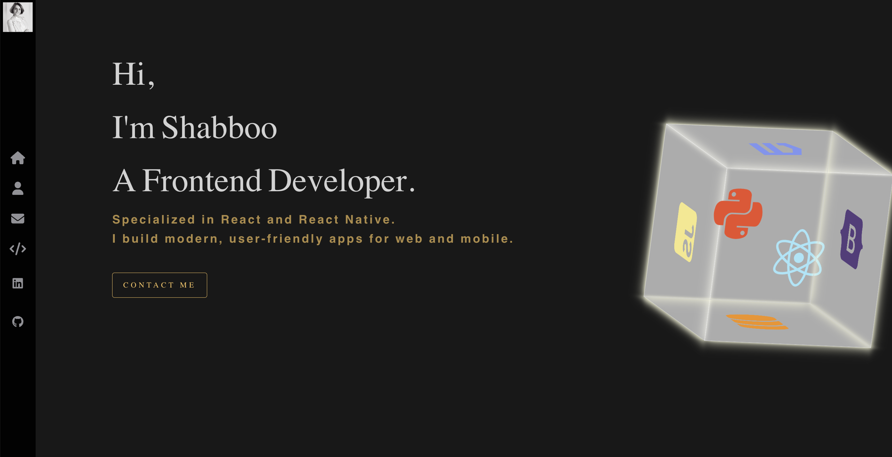
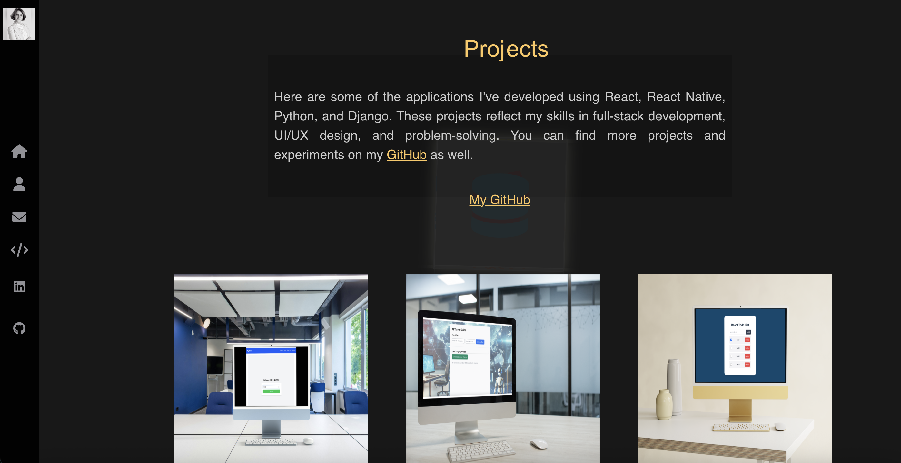
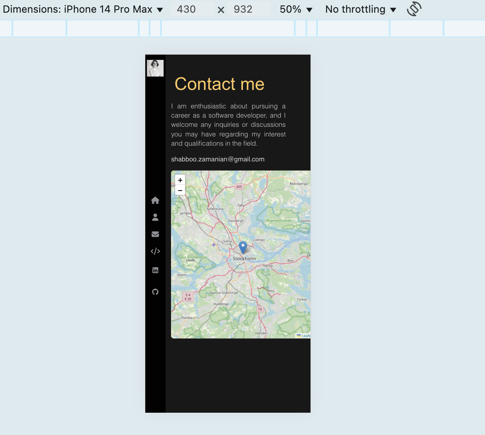

# portfolio

# Developer Portfolio

A responsive and modern portfolio website built using **React**. This project showcases personal projects, skills, and contact information in a clean and professional layout.

## ✨ Features

- Fully responsive layout
- Smooth animations and transitions
- Portfolio projects display
- Contact form
- SEO-friendly meta setup
- Progressive Web App (PWA) support
- Easy customization

## 🚀 Getting Started

### Prerequisites

- Node.js (v14 or later)
- npm (v6 or later) or Yarn

### Installation

1. Clone the repository:

```bash
git clone https://github.com/Shabbo0o/portfolio.git
cd portfolio
```

2. Install dependencies:

```bash
npm install
# or
yarn install
```

3. Run the development server:

```
npm start
# or
yarn start
```

Your app should now be running at http://localhost:3000.

🛠 Build
To create an optimized production build:

```
npm run build
# or
yarn build
```

## 📸 Screenshots

### Homepage



### Projects Section



### Mobile View


